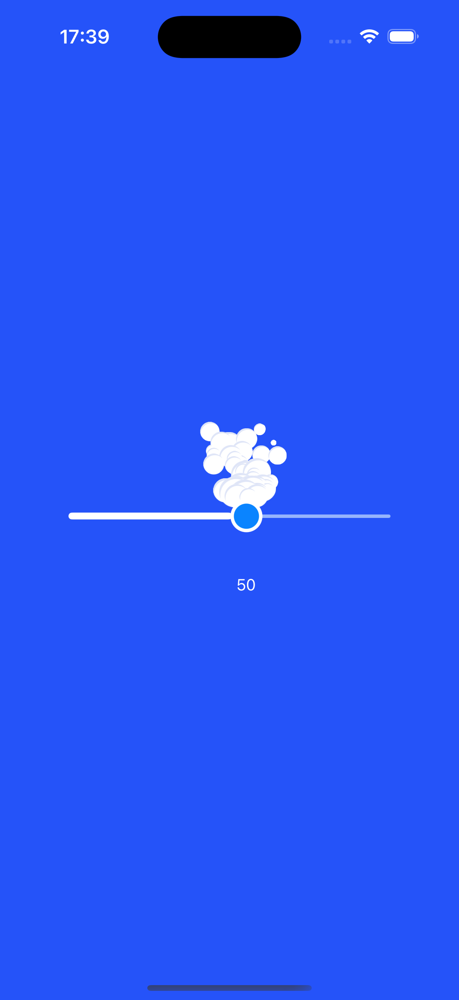

# Smoke Slider 

I crafted this project during my SwiftUI animation exploring the use of ```animation```, ```spritekit particle```.

## Inspiration 💡

The main idea of this source code based on [Smoke Slider](https://dribbble.com/shots/8424211-Smoke-Slider) created by [Aaron Iker](https://dribbble.com/ai).

## Screenshots 🌃



## The tech stack used in this project 🛠

- SwiftUI
- spritekit particle

## Tools

- Xcode 16.0
- Swift 6.0

## Usage

1. Clone the repository:

  ``` bash
    git clone https://github.com/helloItsHEssam/SmokeSlider.git
  ```

###  Contributing 🤝

Contributions, issues, and feature requests are welcome! Feel free to fork the repository and submit a pull request with your changes.

## License

Please check [LICENSE](LICENSE) for details.